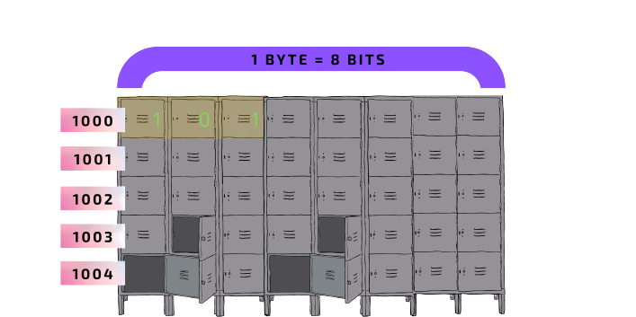

# Sobre Variables Y Constantes
En su nivel más bajo, el lenguaje de las computadoras son unos y ceros.
Estos se puede materializar de distintas maneras. Hoy en día se materializan
mediante pulsos de electricidad.  
Para indicar alguna  instrucción esta se transmite a través
de pulsos o no pulsos de electricidad.En este caso '1' significa
pulso de electricidad y '0' ausencia de pulso.  
En las computadoras la información es guardada 'bytes', el cual es una secuencia
de ocho 'bits'.  Un 'bit' es la unidad mínima de información y se representa como cualquier
cosa que tenga dos posibles valores. Cualquier información de tipo discreto 
puede ser reducida a una secuencia de unos y ceros, por tanto, representables
en bits.  
En una computadora existe una cantidad finita de memoria.Pensemos en un casillero
que tiene 40 casillas. Cuando nosotros guardamos algo en la memoria,esta se transformará
en una secuencia de unos y ceros donde cada valor individual tomará una casilla
temporalmente. Esta información se representa en forma de 'bits' de acuerdo
al tipo de información y su valor y ocupará un espacio en la memoria. Cuando
esa información no sea necesaria se eliminará, brindando ese espacio para nueva
información.  
Tomemos por ejemplo el numero 5, este se representa como: 1 0 1. Cada dígito
se guardará en una casilla independiente y el conjunto de esas casillas tendrá
el valor de '5'. Aquí tenemos la visualizacion:    
  
## ¿Qué es una Variable?
Una variable es un espacio en memoria para almacenar un tipo de dato
y asignar un valor.Como su nombre lo indica, su valor es variable, esto
quiere decir que el valor puede ser modificado.  
Una variable se declara de la siguiente manera:
```js
let colorDeCamisa = 'rojo';
console.log(colorDeCamisa);
```
Aquí suceden dos cosas:  
 1. Se declara una variable denomidada: 'colorDeCamisa'.  
 2. Le asigna el valor de 'rojo' a esta variable.  
Puesto es una variable, es posible modificar su valor:
```js
    colorDeCamisa = 'azul';
    console.log(colorDeCamisa);
```
Dado que la variable ya ha sido declarada no se utiliza 'let'.
## ¿Qué es una Constante? 
Una constante es un espacio en memoria para almacenar un tipo de dato
y asignar un valor.Como su nombre lo indica, su valor es constante, esto
quiere decir su valor no puede ser modificado después de su inicialización.  
Por convención, las constantes que refieren a un numero o cadena de texto
se nombran con mayusculas y guión bajo.Esto para indicar visualmente que se 
trata de un valor que no debería modificarse:
 ```js
const NOMBRE_APELLIDO = "Adrian Jenkins";
console.log(NOMBRE_APELLIDO);
 ```
Aquí suceden dos cosas:  
 1.  Se declara una constante  denominada: 'NOMBRE_APELLIDO'.  
 2. Se le asigna el valor de 'Adrian Jenkins' a esta constante.  
Puesto es una constante, no es posible modificar su valor y nos genera un error:
    NOMBRE_APELLIDO = 'Pedrito Micasa'; // Error
## Formas De Declarar Variables
```js
let var1, var2, var3;
let var4, var5 = 5, var6 = 5;
const CONS1, CONS2, CONS3;
const CONS4, CONS5 = 5, CONS6= 6;
```
## Diferencias entre var, let y  const
## Concepto De Hoisting
Proceso mediante el cual, en la fase de compilacion del motor
de JS las declaraciones de variables y funciones son asignadas en memoria,
por tanto, pueden ser accesadas antes de que tecnicamente sean creadas.
## ¿Qué debería utilizar, let o const?
 Con el tiempo podremos discernir cuando utilizar cada uno. Por el momento, 
 es mejor utilizar constantes ya que estas sí arrojarán errores si el valor es modificado.
 En cambio 'let' modificará el valor de la variable sin darnos cuenta y no arrojará error alguno.
 Es importante destacar que para los iteradores sí debemos de utilizar 'let' ya que estos tienen
 que cambiar de valor en cada iteración. Mas adelante se vera esta materia.
## Convenciones Básicas Para Nombrar Identificadores
 * Los nombres son sensibles a las mayúsculas.
 * El nombre debe ser autodescriptivo
 * Existen varias formas de nombrar las variables, una de ellas es 'camelCase',
 donde la inicial de cada palabra de escribe con mayúscula, a excepción de la primera palabra.
 * Todos los nombres deben comenzar con una letra.
 * Si es una variable 'booleana' se le debe anteponer un 'is' o 'has'.
 * Si es una función se le debe anteponer un verbo como 'get', 'make', 'apply', etc.
 * Si es constante se suelen nombrar en mayúscula en algún formato como: 'SNAKE_CASE'
 * Si es una variable privada se le antepone un '_' para indicar que es de intencion privada.  
## Recapitulando
 1. Las computadoras almacenan la informacion en 'bits', el cual toma valores ceros y unos.
 2. Existen dos formas de almacenar información en JS:
    2.1 let   ===> se utiliza para variables que sabemos van a modificarse en algun momento.
    2.2 const ===> se utiliza para variables constantes, que sabemos no van a cambiar.
 3. Hoisting es el mecanismo donde las declaraciones de variables y funciones pueden
 ser accesadas antes de que tecnicamente sean creadas.  
 4. Como regla general utiliza 'const', sera mas fácil identificar los errores.
